# 🎨 Arquitectura Visual - Tribu Impulsa PWA

## 📊 Diagramas Completos del Sistema

---

## 1. 🏗️ Arquitectura de Alto Nivel

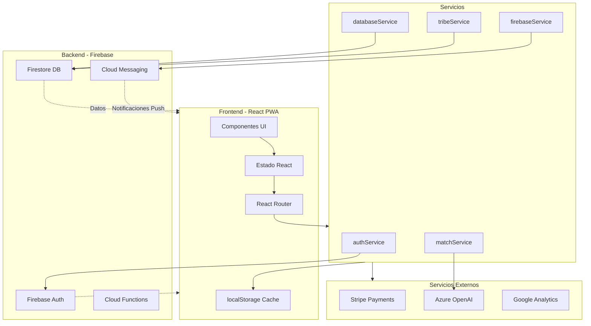

---

## 2. 🗂️ Estructura de Carpetas del Proyecto

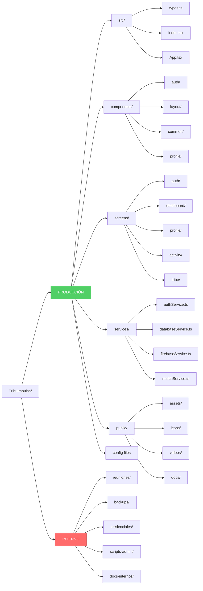

---

## 3. 🔄 Flujo de Datos Completo

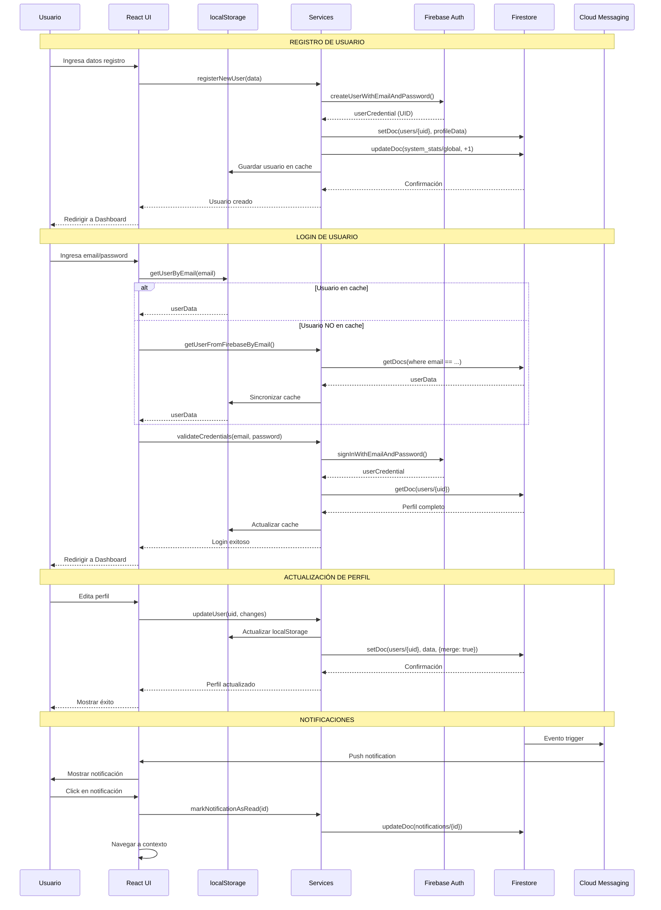

---

## 4. 🧩 Diagrama de Componentes

```mermaid
graph TD
    App[App.tsx]
    
    App --> AppLayout[AppLayout]
    App --> Router[React Router]
    
    Router --> Login[LoginScreen]
    Router --> Register[RegisterScreen]
    Router --> Loading[SearchingScreen]
    Router --> Dashboard[Dashboard]
    Router --> Activity[ActivityView]
    Router --> Directory[DirectoryView]
    Router --> MyProfile[MyProfileView]
    Router --> ProfileDetail[ProfileDetail]
    Router --> Membership[MembershipScreen]
    Router --> Benefits[ClubBienestarView]
    Router --> Tribe[TribeAssignmentsView]
    
    AppLayout --> BottomNav[Bottom Navigation]
    AppLayout --> RallyCounter[Rally Counter]
    
    Dashboard --> StatsCard[Stats Card]
    Dashboard --> FeaturedProfile[Featured Profile]
    Dashboard --> ActivityFeed[Activity Feed Preview]
    Dashboard --> OnboardingModal[Onboarding Modal]
    
    Activity --> NotificationList[Notification List]
    Activity --> NotificationCard[Notification Card]
    
    Directory --> SearchBar[Search Bar]
    Directory --> FilterPanel[Filter Panel]
    Directory --> ProfileGrid[Profile Grid]
    Directory --> ProfileCard[Profile Card]
    
    MyProfile --> ProfileHeader[Profile Header]
    MyProfile --> BioSection[Bio Section]
    MyProfile --> SocialLinks[Social Links]
    MyProfile --> LocationInfo[Location Info]
    MyProfile --> EditModal[Edit Modal]
    MyProfile --> SettingsSection[Settings Section]
    
    ProfileDetail --> ProfileView[Profile View]
    ProfileDetail --> MatchAnalysis[Match Analysis]
    ProfileDetail --> ConnectButton[Connect Button]
    
    Tribe --> ProgressCard[Progress Card]
    Tribe --> TribeMemberGrid[Tribe Member Grid]
    Tribe --> TaskChecklist[Task Checklist]
    
    Membership --> PricingCards[Pricing Cards]
    Membership --> Testimonials[Testimonials]
    Membership --> FAQ[FAQ Section]
    
    Benefits --> BenefitCategories[Benefit Categories]
    Benefits --> BenefitCard[Benefit Card]
    Benefits --> ClaimModal[Claim Modal]
    
    style App fill:#228be6,stroke:#1971c2,color:#fff
    style AppLayout fill:#40c057,stroke:#2f9e44,color:#fff
    style Router fill:#fab005,stroke:#f59f00,color:#fff
```

---

## 5. 🗄️ Modelo de Datos Firestore

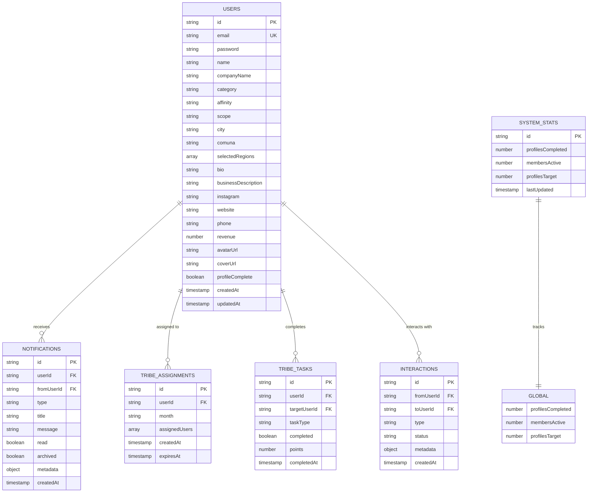

---

## 6. 🔐 Flujo de Autenticación y Permisos

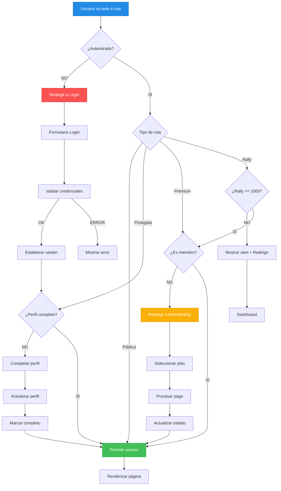

---

## 7. 📱 Flujo de Usuario Completo

---

## 8. 🔄 Ciclo de Vida de los Datos

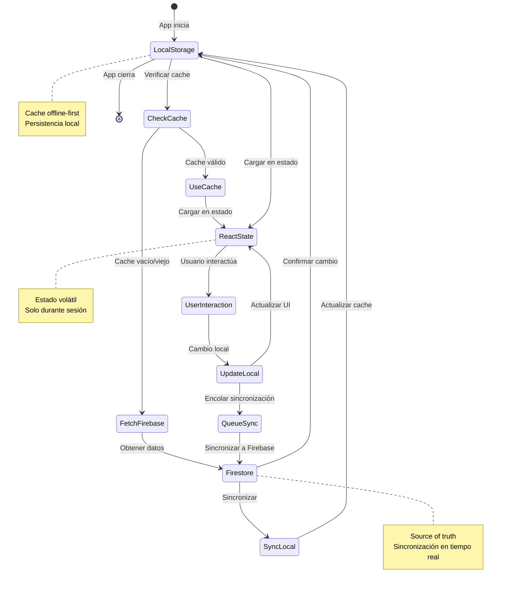

---

## 9. 🎯 Algoritmo de Matching

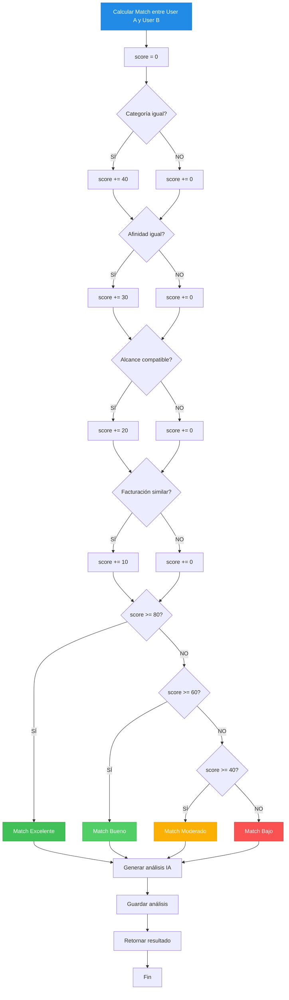

---

## 10. 🎨 Sistema de Diseño y Colores

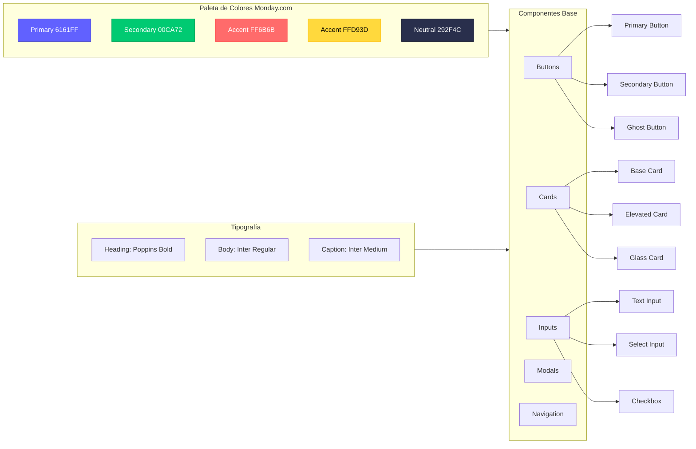

---

## 11. 📊 Métricas y Analytics

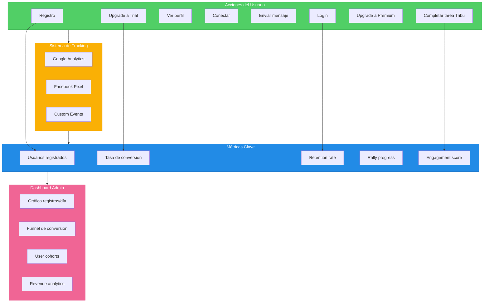

---

## 12. 🚀 Pipeline de Despliegue

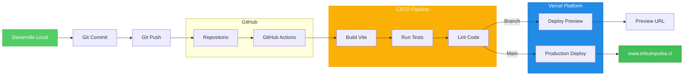

---

## 13. 🔧 Stack Tecnológico

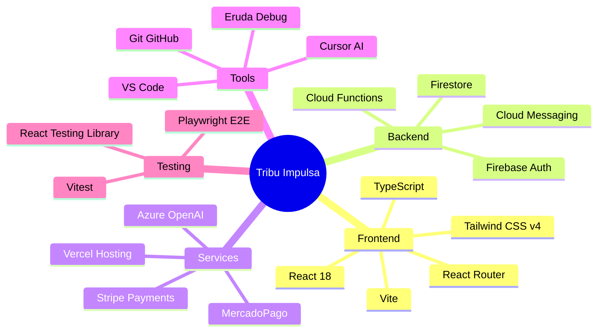

---

## 14. 🎯 Roadmap de Features

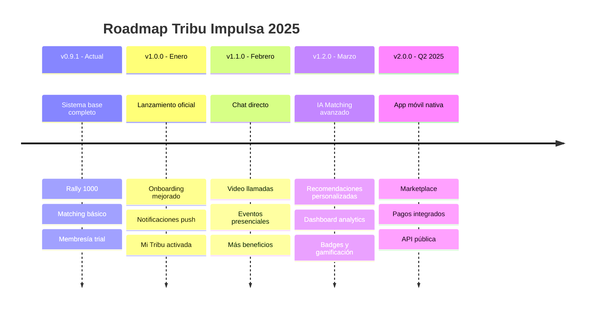

---

## 15. 🌐 Arquitectura de Red

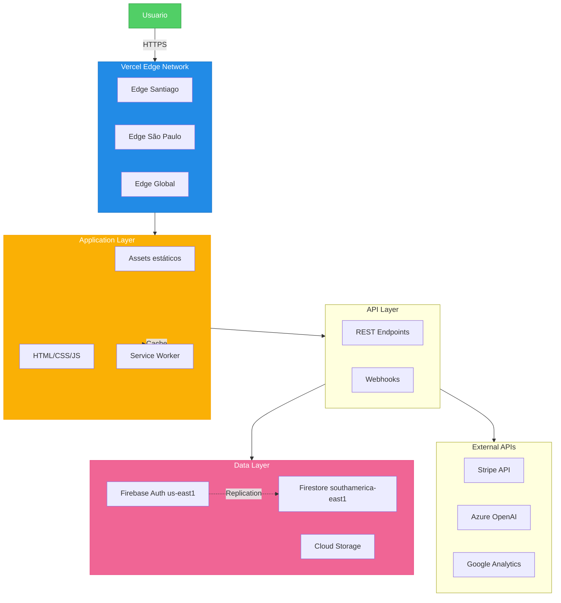

---

**Documento creado:** Diciembre 2024  
**Versión:** v0.9.1  
**Autor:** Sistema de documentación Tribu Impulsa  
**Última actualización:** 25 Dic 2024

